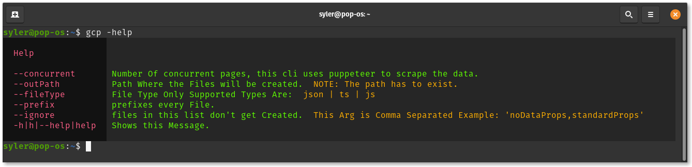

## S.Logger

[](https://bundlephobia.com/result?p=s.logger) [](https://bundlephobia.com/result?p=s.logger) [](https://www.npmjs.com/package/s.logger) [](https://github.com/TheRealSyler/s.logger)

s.loggers purpose is to have colored output in the browser and in node, only supports strings for now.


#### Usage

```typescript
import { Logger, LoggerType } from 's.logger';

const logger = new Logger<{ error: LoggerType; info: LoggerType; browserMessage: LoggerType }>({
  error: {
    styles: ['#f24', { color: '#fc0', background: '#001' }],
    wrappers: [['ERROR [', ']: '], [' ', '! ']]
  },
  info: {
    styles: ['#39f'],
    wrappers: [['INFO: (', ')']]
  },
  // in the Browser, you can add css properties to style the message, in node you can only use color and background.
  browserMessage: {
    styles: [
      {
        color: '#fff',
        padding: '2rem',
        'text-shadow': '1.5px 1.5px 1px red, -1.5px -1.5px 1px blue',
        'font-size': '2rem'
      }
    ],
    wrappers: []
  }
});

logger.Log('error', '404', 'Message');
logger.Log('info', 'Message');
logger.Log('browserMessage', 'Message');
```

##### Or

```typescript
import { Logger, LoggerType } from 's.logger';

const logger = new Logger<{ help: LoggerType }>({
  help: {
    styles: [
      { color: '#f27', background: '#111' },
      { color: '#4e0', background: '#222' },
      { color: '#fa0', background: '#222' }
    ],
    wrappers: [['  ', ' '], [' ', ' '], [' ', ' ']],
    messagesHandler: messages => {
      if (messages.length > 1) {
        const space = 17 - messages[0].length;
        if (space >= 0) {
          messages[0] = messages[0].concat(' '.repeat(space));
        }

        let concatenatedMessages = '';
        for (let i = 1; i < messages.length; i++) {
          const msg = messages[i];
          concatenatedMessages += msg;
        }
        const endingSpace = 110 - (concatenatedMessages.length + (messages.length > 2 ? 4 : 2));
        if (endingSpace >= 0) {
          messages[messages.length - 1] = messages[messages.length - 1].concat(' '.repeat(endingSpace));
        }
      }
      return messages;
    }
  }
});

logger.Log('help', '', '');
logger.Log('help', 'Help', '');
logger.Log('help', '', '');
logger.Log('help', '--concurrent', 'Number Of concurrent pages, this cli uses puppeteer to scrape the data.');
logger.Log('help', '--outPath', 'Path Where the Files will be created.', 'NOTE: The path has to exist.');
logger.Log('help', '--fileType', 'File Type Only Supported Types Are:', 'json | ts | js');
logger.Log('help', '--prefix', 'prefixes every File.');
logger.Log(
  'help',
  '--ignore',
  "files in this list don't get Created.",
  "This Arg is Comma Separated Example: 'noDataProps,standardProps'"
);
logger.Log('help', '-h|h|--help|help', 'Shows this Message.');
logger.Log('help', '', '');
```

<span style="display: flex; justify-content: space-around;">


</span>


